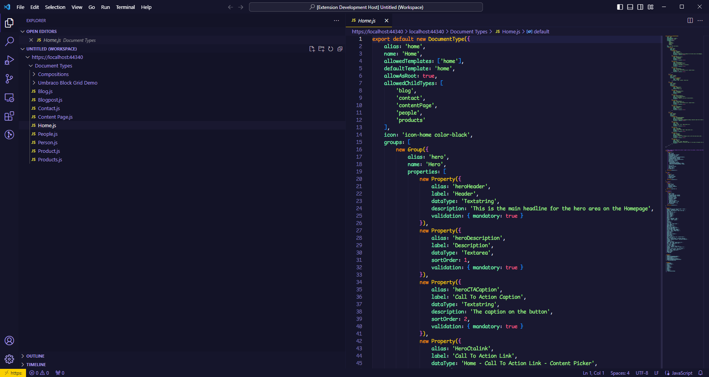
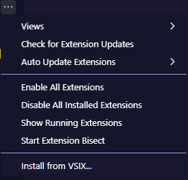

# Umbraco Document Type Editor

This extension allows you to connect VSCode to an Umbraco instance and modify document types as if they were javascript code files.

## Getting started
 1. Install the extension manually (I'll publish it properly once it's a bit more stable :D)
    - Go to extensions.
    - Click the ellipsis icon.
    - Click **Install from VSIX...**.
    - Find and select the VSIX file and click **Install**.
    
 2. Open the command palette.
    - Press `Shift`+`Command`+`P` (Mac) / `Ctrl`+`Shift`+`P` (Windows/Linux); or
    - Press `F1`; or
    - From the Application Menu, click **View > Command Palette.**
 3. Find and run the command `Open Umbraco Workspace`
 4. Enter the URL for the Umbraco site when prompted. (This should be something like `https://localhost:44340` - **you shouldn't really be pointing this at anything other than your local development instance!**)
 5. Enter your Umbraco username and password when prompted (Currently only the built in Umbraco authentication method is supported.)
 6. You should now see a view like the screenshot above with all document types for the Umbraco site listed.

## Why though?
Why not? ;) But really, while Umbraco's backoffice is fairly user friendly, generally it's developers who are defining document types and generally developers would rather write code to define models than click around a UI. This extension is an attempt to make a nice experience for developers to do 99% (give or take) of what they need to do with document types in code.

## Notes / Issues / Gotchas
 - Document types are listed with their display names so the document type tree matches Umbraco as closely as possible, however every content type will have .js suffixed to the file name because otherwise vscode can detect the file type as typescript, which then ignores the JSDoc type definitions.
   - Speaking of, classes with JSDoc type definitions are dumped at the bottom of each file because VSCode's typescript language service doesn't support virtual file systems which is how this view of documents is implemented. It *does* however support intellisense for things that are in the same file, so this felt like a decent workaround.
   - There are actually a couple of types defined that will be specific to each document type, namely the `AvailableCompositions` and the `AvailableChildTypes` so it makes sense to define these per file.
 - When you save a file, the extension will look for a default export of a `DocumentType` and ignore everything else (which is why the class definitions get ignored!).
 - *Most* fields that are available in the Javascript class are a 1:1 mapping with the `DocumentTypeSave` model that the Umbraco backoffice controller uses, however I've made a few changes where things didn't align well to the backoffice UI to make things more intuitive, for instance:
   - Most significantly, only fields that have been changed will be part of the generated code to keep things relatively clean and readable.
   - Umbraco uses represents Tabs **and** Groups as a `PropertyGroup`, with an enum value to identify which one is which. `PropertyGroup` can't contain another `PropertyGroup` so a Group is associated with a Tab via the alias `{tabAlias}/{groupAlias}`. I've instead separated these into two classes and then resolve back the Umbraco way when you save.
   - The "Enable list view" flag is called `isContainer` on the Umbraco model, so I've named it `enableListView` instead.
   - Likewise I've used the name `compositions` instead of the Umbraco model `compositeContentTypes`.
   - `allowedChildTypes` is a list of document type ids on the Umbraco model, but aliases are way easier to work with so I've mapped to aliases on code generation, and map back to ids when you save.
 - Changing the name of a document type in the code editor will display an error on save because vscode sees that the file has disappeared, because file names are based on the content type name; the save actually succeeds and refreshing the workspace will show the new file.
 - The Umbraco backoffice has various checks that prevent you from selecting nonsensical combinations of settings, e.g. setting a document type to be an element type **and** allowing it to be created at root. This extension won't stop you from doing those things.
